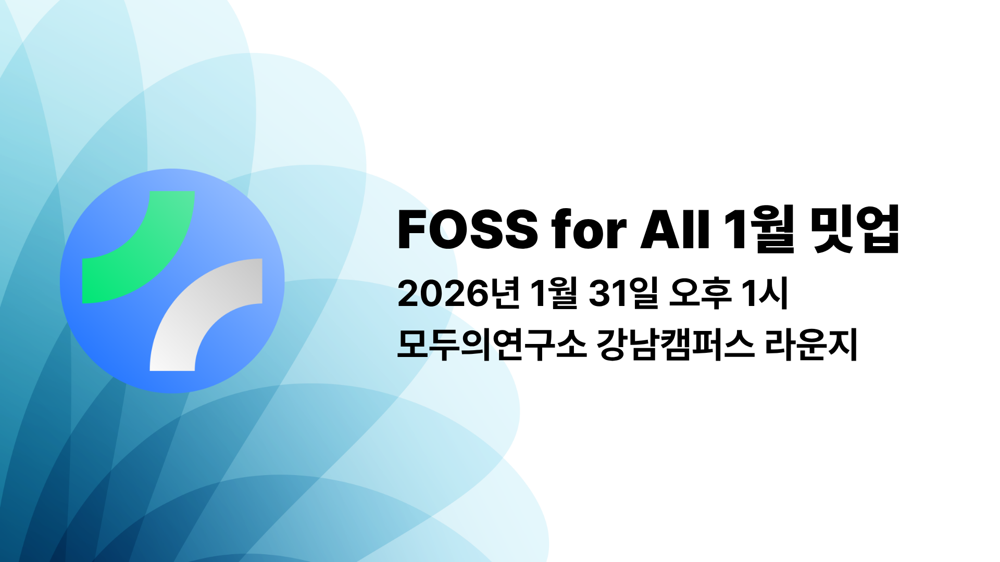

Join our very first FOSS for All meetup in late January!

At FOSS for All's first meetup, we'll cover a domestic case study on fiscal sponsorship and share a recap from the Inclusive Technology Experts Roundtable.

If you're interested in open source projects and communities, and also in how fiscal sponsorship can provide administrative and financial support to these communities, you're welcome to attend after pre-registration. We hope to see many of you at the very first FOSS for All meetup!

## Event Information
- Date/Time: January 31, 2025 at 1:00 PM
- Location: Modu Labs Gangnam Campus Lounge

## Meetup Sessions
### Domestic fiscal sponsorship case study - focusing on the Root Impact example

**Seongjun Moon - Director @ FOSS for All**

Abroad, it is common for nonprofit organizations to provide fiscal sponsorship to multiple open source projects and communities, allowing them to raise funds through donations without forming separate legal entities and to allocate those funds where needed within open source organizations. In Korea, however, such cases are rare and not well known. Root Impact's pilot introduction and operation of fiscal sponsorship is one of those rare cases. We'll take a closer look at Root Impact's adoption and experience, and discuss the possibility of introducing fiscal sponsorship domestically, especially whether it could be introduced to FOSS for All.

### Visiting the Ministry of Gender Equality and Family's digital inclusion technology expert roundtable

**Joowang Im, Tahee Kim - Member @ FOSS for All**

The Digital Inclusion Act, which guarantees digital rights for all citizens including people with disabilities, seniors, women, and immigrants, was enacted last year and will take full effect at the end of January this year. Accordingly, major government ministries such as the Ministry of Gender Equality and Family have recently held expert roundtables to gather advice from various sectors. At this roundtable, FOSS for All's steering committee and members were appointed as advisors and joined civic tech networks, impact investors, and other civil society groups to collaborate. In this session, FOSS for All proposed the core values of open source for realizing digital inclusion and future contribution plans in depth. This talk shares how open source can build an inclusive technology ecosystem amid these policy changes.

## Schedule

| Time | Topic | Speaker |
| --- | --- | --- |
| 12:30 - 13:00 | Check-in | |
| 13:00 - 13:30 | Opening | |
| 13:30 - 14:30 | Domestic fiscal sponsorship case study - focusing on the Root Impact example | Seongjun Moon (Director @ FOSS for All) |
| 14:30 - 14:40 | Break | |
| 14:40 - 16:00 | Visiting the Ministry of Gender Equality and Family's digital inclusion technology expert roundtable | Joowang Im, Tahee Kim (Member @ FOSS for All) |
| 16:00 - 17:00 | Networking | |
※ The schedule may be adjusted on the day.

## Sponsors
This meetup venue was sponsored by **Modu Labs**!

## Registration

To join this meetup, please register in advance via the Ticketaco link below!

[**Register now on Ticketaco**](https://ticketa.co/e/ajhehljc)
