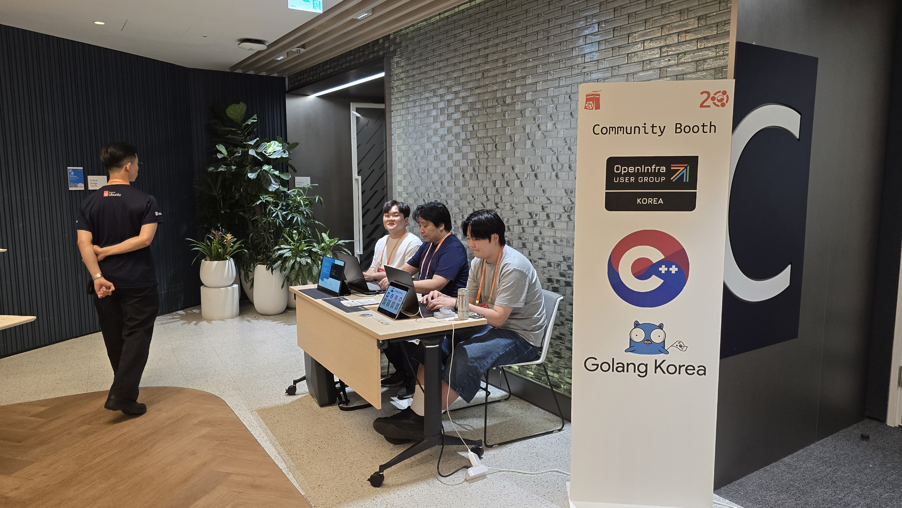
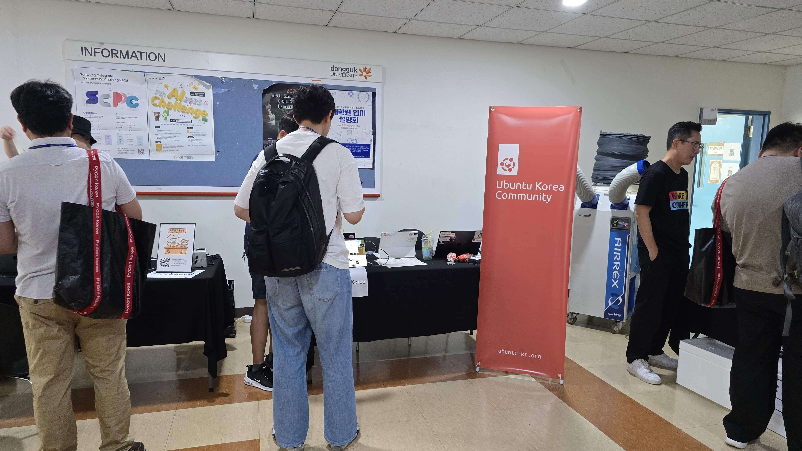

Starting today, you can apply for a community booth at the very first FOSS for All Conference 2025.
If you want to promote your open source project or community to conference attendees, this is a great opportunity.

Use a community booth to engage directly with attendees—introduce your project, recruit contributors, run hands-on demos, distribute materials and swag, and network.
Applications are open until September 19. Apply via the link below.

https://2025.fossforall.org/en/cfp/

# Preview
Because FOSS for All Conference 2025 is our first edition, we don’t have past photos to share.
However, there are examples of community booths from other conferences that can give you an idea of potential setups.
Please note these images are for reference only; actual booth configurations may vary.

> UbuCon Korea 2025 community booth (shared booth)

> PyCon Korea 2025 community booth

# Info & Inquiries

Community booths are open to non-profit basis communities. Companies and institutions can operate a booth through sponsorship. [See detailed sponsorship information here.](https://2025.fossforall.org/en/become-a-sponsor/)

For any questions about community booths, please contact program@fossforall.org anytime.
