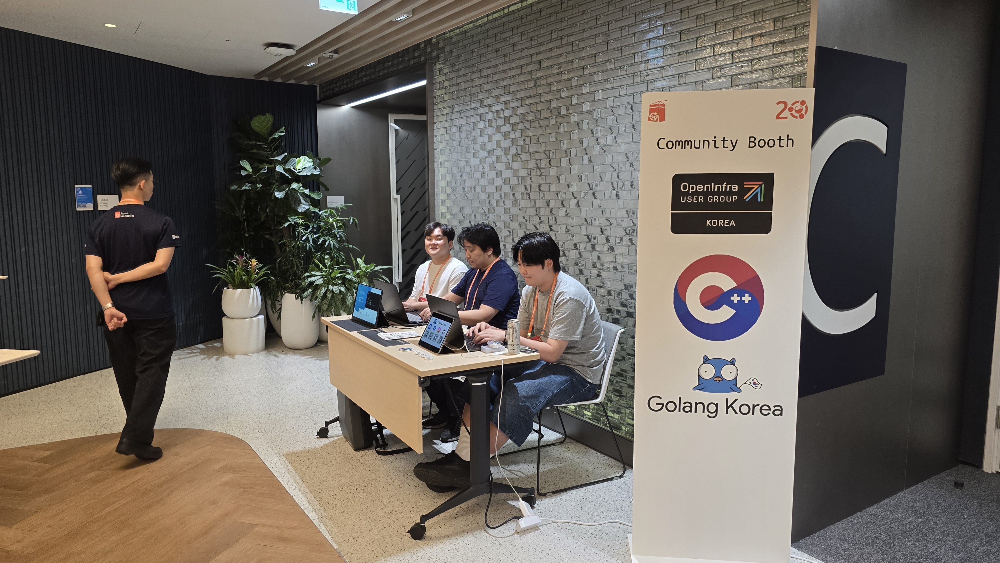

올해 처음으로 개최되는 FOSS for All Conference 2025, 오늘부터 커뮤니티 부스도 지원하실 수 있습니다.
운영중인 오픈소스 프로젝트나 오픈소스 커뮤니티를 컨퍼런스 참석자 대상으로 홍보하고 싶다면, 좋은 기회입니다.

커뮤니티 부스를 통해 참가자 분들과 직접 소통하면서, 프로젝트 소개, 기여자 모집, 체험 및 시연, 자료와 굿즈 배포, 네트워킹 등 다양한 활동에 활용해 보세요.
부스 지원은 9월 19일 까지 하실 수 있으며, 아래 링크를 클릭하여 지원하실 수 있습니다.

https://2025.fossforall.org/cfp/

# 미리보기
올해 FOSS for All Conference 2025 는 첫 회차 행사여서, 지난 행사 사진을 참고용으로 보여드리긴 어렵지만.
이미 다른 컨퍼런스에서 커뮤니티 부스 운영 사례가 있어, 이를 참고하면 어떤 형태의 부스가 될지 참고하실 수 있습니다.
다만 아래 사진은 참고용도이며, 실제 부스 구성은 차이가 있을 수 있음을 알려드립니다.

> UbuCon Korea 2025 커뮤니티 부스 (공유부스)

> PyCon Korea 2025 커뮤니티 부스

# 안내 & 문의

커뮤니티 부스는 비영리 형태로 운영되는 커뮤니티를 대상으로 지원을 받고 있습니다. 기업/기관의 경우 후원사 참여를 통해 부스를 운영하실 수 있습니다. [여기에서 자세한 후원사 참여 정보를 확인하실 수 있습니다.](https://2025.fossforall.org/become-a-sponsor/)

커뮤니티 부스 관련 문의사항은 program@fossforall.org 로 언제든 연락 해 주시기 바랍니다.