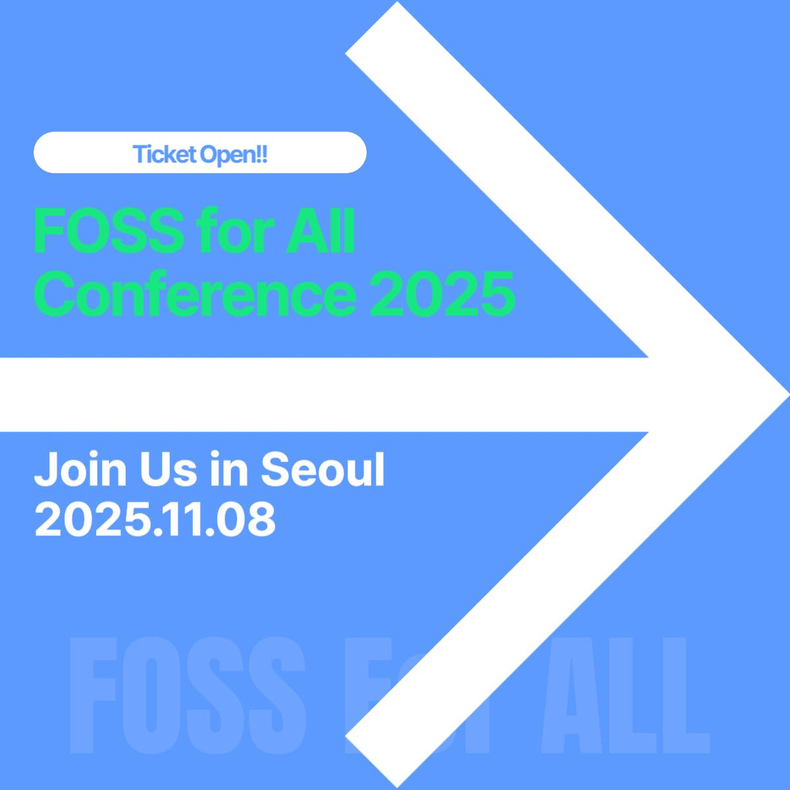

올해 처음으로 개최되는 FOSS for All Conference 2025, 발표 제안과 커뮤니티 부스 지원이 어느덧 마감 되었고, 참가 등록이 이미 시작 되었습니다.

컨퍼런스에 참석 예정이라면, 아래 링크를 클릭하여 이벤터스에서 참가등록 해 주시기 바랍니다. 기본 티켓(2만원), 후원 티켓(10만원), 비즈니스 티켓(10만원) 중 선택 하실 수 있습니다.

[**이벤터스에서 참가등록**](https://event-us.kr/fossforall/event/110400)

## 발표자 및 커뮤니티 부스 선정
현재 발표자 선정은 어느정도 완료가 되어, 제안서 검토 결과가 이메일로 발송 되었습니다. 검토 결과 이메일을 받았다면, 최종 참석 여부를 pretalx.fossforall.org 에서 알려 주시기 바랍니다. 이메일을 받지 못하였다면, 스팸함을 한번 확인 해 보시거나 pretalx.fossforall.org 에서 검토 결과를 확인 하실 수 있습니다. 최종 참석 여부가 확인된 발표자 분들은 추후 참가 등록 관련하여 별도로 안내를 드리겠습니다.

커뮤니티 부스는 현재 검토가 진행중에 있습니다. 마찬가지로 검토 완료 후 이메일로 결과를 알려드릴 예정입니다.

## 광운대학교에서 뵙겠습니다!
어느덧 행사 날 까지 한 달 하고도 몇 주 앞으로 다가 왔습니다. 10월에는 발표자와 각 세션 주제도 순차적으로 공개 할 예정입니다. 행사 참석 예정이고, 어떤 행사가 될 지 궁금하다면 FOSS for All [홈페이지](https://fossforall.org), 소셜미디어, [Discord](https://discord.gg/YbXE6ZMpbX)등 다양한 채널에 들어오셔서 FOSS for All 단체 및 컨퍼런스 소식을 먼저 받아보실 수 있답니다.

행사 관련하여 궁금하신 점은 언제든 contact@fossforall.org (행사전반, 참가등록 등), program@fossforall.org (발표, 부스 등 관련) 에 문의 해 주시거나, Discord 에서도 문의 해 주시기 바랍니다!
