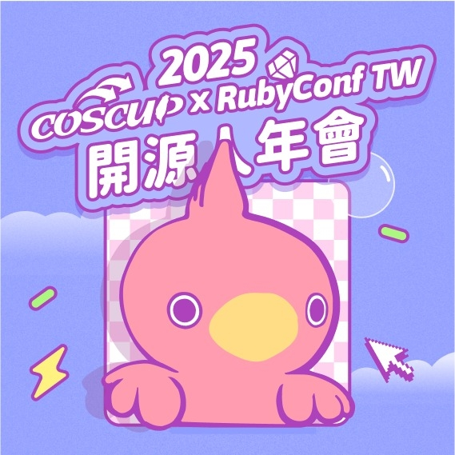

안녕하세요! FOSS for All은 2025년 8월, 대만에서 열린 아시아 최대 오픈소스 행사인 COSCUP에 참가하여 부스를 운영하였습니다.
이번 참여를 통해 국제 오픈소스 커뮤니티와의 교류와 협업의 가능성을 확인하고, 우리나라 오픈소스 생태계의 발전을 위해 중요한 경험을 쌓았습니다.

본 페이지에서는 COSCUP에 참가한 FOSS for All 멤버들과 함께해주신 분들의 생생한 후기를 저자별로 나누어 전달해 드립니다.
각 후기를 통해 행사 현장의 분위기, 느낀 점, 그리고 FOSS for All의 앞으로의 비전을 확인해보세요.

---

## FOSS for All 컨퍼런스 홍보

COSCUP에서 FOSS for All이 가장 중점적으로 진행한 활동 중 하나는 오는 **11월 8일 광운대학교**에서 열릴 예정인
**FOSS for All Conference 2025**의 홍보였습니다!

- 행사 홈페이지: [2025.fossforall.org](https://2025.fossforall.org)
- 날짜: 2025년 11월 8일
- 장소: 광운대학교

오픈소스에 관심 있는 모든 분들을 환영합니다. 현장에서 직접 만나뵙고 뜻깊은 교류의 장을 만들어 가길 기대합니다.

---

아래 저자별 후기를 통해 각자의 시선과 경험을 확인해 보시고, 궁금한 점이 있으면 언제든 FOSS for All에 문의해 주세요!

---

## 대만하면 무엇이 떠오르시나요? - 문성준

버블티? 펑리수? 물론 대만에는 맛있는 음식이 정말 많지만, 저에게는  
오픈소스 행사 COSCUP이 가장 먼저 생각납니다.

“여름 한창에 왜 대만에 가냐” 하실 수도 있겠지만, 저에게는 이 시기에 꼭  
대만에 가야 한다고 느껴질 만큼 좋아하는 행사입니다. COSCUP은 Conference  
for Open Source Coders, Users, and Promoters의 줄임말인데요, 개발자뿐만  
아니라 사용자와 홍보자까지 이름에 포함된 점이 무척 포용적이고 인상  
깊었습니다.

사실 2023년 처음 대만에 갔을 때만 해도 저는 COSCUP이라는 행사를 전혀  
알지 못했습니다. 오픈소스 활동을 조금씩 해오고 있었는데도 말이죠. 하지만  
COSCUP 전야제인 맥주 파티부터 분위기에 푹 빠졌습니다. 익숙한 얼굴도  
있었지만 처음 보는 분들이 훨씬 많았는데, 놀랍게도 모두 따뜻하게  
맞아주셔서 금세 즐겁게 이야기 나눌 수 있었습니다.

행사 기간 동안 부스를 운영하고, 세션에도 참여하면서 정말 많은 것을  
배우고 느낄 수 있었습니다. 준비가 부족했지만 라이트닝 토크에서 발표할  
기회도 얻었고, 감사하게도 많은 분들이 긍정적으로 반응해주셨습니다.  
무엇보다 크게 와닿았던 점은, 다양한 배경의 사람들이 모여 서로의 경험과  
지식을 나누며 자연스럽게 교류하는 분위기였습니다. 단순히 발표를 듣는  
자리가 아니라, 누구나 참여하며 배우고 연결되는 장이었죠.

그때 저는 “한국에도 이런 행사가 있었으면 좋겠다”는 생각을 처음 하게  
되었습니다. 다행히 비슷한 마음을 가진 분들을 만나 힘을 모을 수 있었고,  
그렇게 탄생한 것이 바로 **FOSS for All 컨퍼런스**입니다.

FOSS for All은 단순한 기술 행사를 넘어, **국내외 다양한 오픈소스  
커뮤니티가 모여 서로 교류하는 축제 같은 장**을 지향합니다. 발표 세션뿐  
아니라 커뮤니티 부스와 라이트닝 토크를 통해, 누구나 자유롭게 목소리를 낼  
수 있는 자리를 마련했습니다. COSCUP에서 느꼈던 따뜻한 분위기와 활발한  
교류를 한국에서도 똑같이 경험할 수 있도록 준비하고 있습니다.

그래서 이번 COSCUP 부스를 통해 저희가 전하고 싶었던 가장 큰 소식은, 오는  
11월 8일 광운대학교에서 열리는 FOSS for All 2025였습니다. COSCUP에서  
받은 영감을 한국에서 다시 이어가고 싶습니다. **11월 8일**, 현장에서 꼭  
만나 뵙기를 바랍니다!

---

## COSCUP x RubyConf Taiwan 2025 Recap with FOSS for All - 유현아

2025년 8월 9일부터 10일까지 대만 타이베이에서 열린 COSCUP x RubyConf  
Taiwan 2025 오픈 소스 커뮤니티의 축제 현장을 다녀왔습니다! 올해는  
COSCUP의 20주년이자, RubyConf Taiwan과의 협업으로 더욱 풍성한 구성과  
다채로운 글로벌 교류가 돋보였어요

이 글에서는 저희의 활동, 분위기, 그리고 국제 컨퍼런스 참여 시 도움이 될  
만한 꿀팁까지 생생하게 전달해 드리려고 합니다.

---

### COSCUP 소개

출처 - [coscup.org/2025/en/](https://coscup.org/2025/en/)

COSCUP(Conference for Open Source Coders, Users, and Promoters)는  
2006년부터 이어져 온 대만의 대표적인 오픈 소스 커뮤니티 행사입니다.  
개발자, 사용자, 그리고 오픈소스 전파자 간의 교류를 통해 자유 오픈소스  
소프트웨어(FOSS)의 철학과 기술을 확산하고 있습니다.

올해는 RubyConf Taiwan과의 협업으로 COSCUP x RubyConf Taiwan 2025라는  
이름 아래, 더욱 다양한 세션과 국제적 교류의 장을 마련했습니다.

---

### 포스포올 소개

포스포올(FOSS for All)은 지속 가능한 자유/오픈소스 소프트웨어 생태계  
구축을 목표로, 국내외 다양한 커뮤니티와 프로젝트가 함께 시작한 비영리  
단체입니다. 커뮤니티가 본연의 활동에 집중할 수 있도록 재정 후원(fiscal  
sponsorship)을 비전으로, 오픈소스 참여자들이 서로 연결되고 협업할 수  
있는 장을 컨퍼런스를 통해 마련하고자 합니다.

올해는 특히 첫 번째 FOSS for All Conference 2025가 열릴 예정으로, 한국  
오픈소스를 알리고 커뮤니티의 허브가 위한 준비를 모색 중입니다. 이번  
COSCUP 방문은 이러한 컨퍼런스의 취지와 비전을 소개하고, 함께할 연사자  
모집을 알리기 위한 의미 있는 활동이었습니다.

---

### 한국 커뮤니티 부스 소개

행사 기간 동안 저희는 커뮤니티 부스를 운영하며 FOSS for All의 비전을  
직접 소개하고, 방문자들과 활발히 소통했습니다. 부스를 찾은 참가자들에게  
컨퍼런스 소식을 알리고, 국내외 다양한 프로젝트와 협력의 가능성을 모색할  
수 있었습니다. 현장에서 만난 글로벌 커뮤니티와의 교류는 앞으로 FOSS for  
All이 지향하는 단체로 성장할 수 있는 중요한 계기가 되었습니다.

한국 부스에서는 **국내에서 진행 중인 오픈소스 프로젝트 소개**,  
**커뮤니티 행사(예: PyCon Korea, 오픈소스 세미나, 지역 모임 등)**,  
그리고 **굿즈와 자료 배포**를 통해 참가자들에게 친근하게 다가갔습니다.  
부스를 중심으로 자연스럽게 대화가 이어지면서 한국과 대만, 그리고 아시아  
전역의 개발자들이 협력할 수 있는 새로운 접점을 발견할 수 있었습니다.

무엇보다 한국 커뮤니티 구성원들이 직접 현장에서 경험과 지식을 나누며,  
“한국 오픈소스 생태계는 어떤 흐름 속에 있는지”, “국제 커뮤니티와 어떻게  
연결을 하고 싶은지”를 보여줄 수 있었습니다. 글로벌 오픈소스 흐름을 함께  
만들어가고 있음을 확인할 수 있었던 의미 있는 순간이었습니다.

---

### COSCUP 주요 프로그램

#### 오프닝

행사의 문을 여는 **오프닝 세션**에서는 주최 측의 환영 인사와 함께  
프로그램 전반에 대한 소개가 있었습니다. 대만뿐 아니라 다양한 국가에서  
모인 참가자들이 함께 자리하여, 시작부터 뜨거운 열기를 느낄 수  
있었습니다. 특히 현장에서는 **중국어와 영어가 자연스럽게 섞여 소통**이  
이루어졌는데, 언어가 다르더라도 “오픈소스”라는 공통의 관심사가 사람들을  
하나로 이어주는 것을 실감할 수 있었습니다.

행사의 **엔딩 세션**에서는 참가자들이 각자 활동 중 얻은 경험과 정보를  
나누며, 함께한 시간에 대한 감사를 전했습니다. 자원봉사자와 운영진,  
연사와 참가자 모두가 서로에게 고마움을 표현하며 따뜻하게 마무리되었고,  
‘다시 만나자’는 약속과 함께 기쁘게 행사의 막을 내렸습니다.

#### 세션 — *Let's build a Transformer: JAX Source code explained from scratch*

이번 행사에서 특히 눈길을 끈 세션 중 하나는 “Let's build a Transformer:  
JAX Source code explained from scratch”였습니다. Transformer 아키텍처는  
이제 자연어 처리(NLP)와 컴퓨터 비전(CV)을 넘나드는 범용 모델이 되었죠.  
발표자는 사전 학습된 거대한 모델을 단순히 사용하는 데 그치지 않고,  
**JAX를 활용해 Transformer를 처음부터 직접 구현하는 과정**을  
보여주었습니다. 40분 남짓한 시간 동안 모델의 각 컴포넌트가 어떻게 쌓여 하나의 구조를  
이루는지, JAX의 장점인 **자동 미분과 함수형 프로그래밍 스타일**이 어떻게  
자연스럽게 녹아드는지 차근차근 설명해 주었는데요. 덕분에 “복잡한 모델도  
결국은 작은 블록의 조합”이라는 점을 다시금 체감할 수 있었습니다.  
연구자뿐 아니라 실무자 입장에서도, **커스터마이즈 가능한 Transformer  
구현의 가능성**을 직접 엿볼 수 있었던 인상 깊은 시간이었습니다.

#### BoF — *Building Global Communities: Beyond Cultural and Ideological Divides*

오후에는 **Birds of a Feather(BoF)** 세션에 참여했습니다. 주제는  
*"Building Global Communities — Beyond Cultural and Ideological Divides"*였는데요, 이름처럼 단순한 기술 토론을 넘어 **커뮤니티 운영과  
글로벌 협업**을 진지하게 고민해볼 수 있는 자리였습니다.

발표를 맡은 **Masafumi Ohta** 님은 OpenSolaris, Raspberry Pi, OpenStack  
등 글로벌 프로젝트에서 활동해온 경험을 공유했습니다. 특히 COSCUP과  
OSPN이 지난 3년간 트랙 교류를 이어오면서 겪었던 시행착오와, 이제는  
서로의 장점을 살려 본격적인 연대가 가능해졌다는 이야기가 인상  
깊었습니다.

인터넷과 오픈소스가 국경을 허물며 만들어낸 **다양성과 확장성**, 그리고  
그 과정에서 마주하는 **문화적·이념적 차이를 극복하는 방법**에 대한  
토론은 많은 참가자들에게 울림을 주었습니다. BoF답게 발표와 토론이  
자유롭게 오가며, “글로벌 커뮤니티에 어떻게 참여할 것인가”라는 질문을  
각자 마음속에 새기게 한 세션이었습니다.

#### 라이트닝 토크 — *포스포올(FOSS for All) 소개*

짧지만 강렬했던 라이트닝 토크 시간에는 **포스포올(FOSS for All)**을  
직접 소개할 기회가 있었습니다. 제한된 시간 속에서 “지속 가능한 오픈소스  
생태계를 만들기 위해 어떤 역할을 하고 있는지”, 그리고 “다가올 첫 번째  
컨퍼런스를 통해 어떤 만남과 협업을 꿈꾸고 있는지”를 청중과 나눴습니다.

짧은 발표였지만, 현장에서는 **새로운 시도에 대한 관심과 응원**을 많이  
받을 수 있었습니다. 발표를 마친 뒤 부스를 다시 찾은 분들과 대화를  
이어가면서, 포스포올이 단순한 이름이 아니라 **국내외 커뮤니티를 잇는  
플랫폼으로 성장할 수 있겠다**는 확신을 얻을 수 있었습니다.

#### 전야제 & 땡큐파티

공식 일정 전날 열린 전야제에서는 서로 아직 낯선 참가자들이 미리 만나  
네트워킹을 하고, 행사 기간 동안 더 가깝게 교류할 수 있는 분위기를  
만들었습니다. 음악과 가벼운 음식을 곁들인 자리에서 다양한 배경의  
개발자들이 어울리며, 오픈소스라는 공통된 관심사로 자연스럽게 대화를  
이어가는 모습이 인상적이었습니다.

마지막 날 저녁에는 땡큐 파티(Thank You Party)가 열렸습니다. 이번  
COSCUP을 성공적으로 치를 수 있도록 힘쓴 자원봉사자들과 운영진에게 감사의  
마음을 전하는 자리였고, 참가자들도 함께 모여 행사의 마지막을 즐겁게  
마무리했습니다. 자유로운 대화와 웃음이 오간 이 시간은 “커뮤니티가 있기에  
이런 행사가 가능하다”는 사실을 다시금 느끼게 해주었습니다.

---

### 마무리

이번 COSCUP x RubyConf Taiwan 2025은 **커뮤니티와 사람이 중심이 되는  
축제**였습니다. 다양한 세션을 통해 얻은 지식뿐 아니라, 부스를 찾은  
참가자들과의 짧은 대화, 그리고 글로벌 커뮤니티와의 연결에서 더 큰 의미를  
발견할 수 있었습니다.

특히, 이번 방문은 **FOSS for All**이 앞으로 본격적인 활동을 펼쳐나가는  
첫걸음이자, 한국 오픈소스 커뮤니티가 국제 무대와 자연스럽게 이어질 수  
있다는 가능성을 확인한 소중한 시간이었습니다.

COSCUP에서 만난 경험과 배움은 곧 열릴 **FOSS for All Conference 2025**로  
이어져 더 많은 사람들과 공유될 예정입니다. 이번 만남을 통해 다진 인연과  
배움을 바탕으로, 한국 오픈소스 커뮤니티가 한층 더 성장하고 글로벌 무대와  
활발히 교류하길 기대합니다.

---

### 이번 활동에 기여해 주신 분들

6월 13일부터 COSCUP 준비 및 참여해 주신 분들은 다음과 같습니다.

조성수, 문성준, 황동하, 정미르, 양형준, 유현아

---

### 포스포올 알아보기

- *Home:* https://fossforall.org/  
- *Facebook:* https://www.facebook.com/fossforall  
- *LinkedIn:* https://www.linkedin.com/company/foss-for-all  

---

## COSCUP의 원동력 - 조성수

저의 첫 COSCUP은 23년이었습니다. 우분투, C++ Korea, 클라우드 유랑단 등  
한국의 오픈소스 커뮤니티 운영진 분들과 함께 한국의 오픈소스 커뮤니티  
활동을 대만에 소개하기 위해 부스를 마련하여 참석했었습니다.

( 사진 1: 23년 COSCUP에 마련한 커뮤니티 부스 )

### COSCUP 컨퍼런스 등록

COSCUP은 제가 그동안 경험한 기술 컨퍼런스의 전형적인 모습을 완전히  
깨버리는 새로운 형식의 컨퍼런스였습니다. 가장 놀라웠던 점은 컨퍼런스  
참여의 시작인 “등록”이 없습니다. 우리가 컨퍼런스에 참여한다면 공식  
홈페이지에서 티켓을 구매하거나, 무료 행사라면 개인정보를 입력하여  
“등록”하는 과정을 거칩니다. COSCUP은 이 과정이 없습니다. 누구나 참여할  
수 있고, 현장에서 이름표에 자신의 이름을 쓰고 입장하면 됩니다.  
오픈소스가 누구에게나 열려있다는 점에서 오픈소스를 주제로 하는  
컨퍼런스도 같은 철학을 이어받아 운영하는 모습으로 느껴져서 매우 새롭고  
따뜻한 모습이었습니다.

( 사진 2: COSCUP의 이름표 부스 )

### COSCUP의 엔진 - 스태프

또한, COSCUP의 모든 운영을 담당하는 스태프는 자원봉사자로 이루어집니다.  
세션 운영부터 사진 촬영, 녹화, 행사 전반적인 운영 모두 자원봉사자로  
이루어져 있습니다. 그래서 그런지 형식적인 행사의 느낌이 아니라 편안한  
느낌이 듭니다.  
[https://coscup.org/2025/en/staff/](https://coscup.org/2025/en/staff/)  
홈페이지의 staff 목록만 보더라도 매우 많은 사람들이 COSCUP을 만들고  
운영하고 있는 것을 보실 수 있습니다.

COSCUP의 자원봉사자 시스템이 궁금하시다면  
[https://volunteer.coscup.org/](https://volunteer.coscup.org/)  
에서 자세한 내용을 확인할 수 있습니다.

### 오픈소스 커뮤니티의 참여

COSCUP은 모든 종류의 오픈소스 프로젝트 / 커뮤니티를 다루는 컨퍼런스인  
만큼 정말 다양한 오픈소스 프로젝트와 커뮤니티가 참여합니다. 기술 발표 뿐  
아니라 커뮤니티 부스를 통해 오픈소스 프로젝트와 커뮤니티가 자신들의  
활동과 프로젝트를 소개할 수 있도록 지원하고 있습니다. 커뮤니티 부스는  
돈을 지불하는 것이 아닌 기술 발표를 지원하는 것과 동일하게 부스 지원  
신청을 하고 선정이 되면 부스를 무료로 제공받는 구조입니다.

올 해는 COSCUP과 OCF(Open Culture Foundation)에서 주로 영감을 받아 만든  
FOSS for All 단체와 컨퍼런스를 홍보하기 위해 커뮤니티 부스를 신청하였고,  
운이 좋게 승인되어 부스를 운영하였습니다....

COSCUP 부스의 모습은 생각보다 매우 단순합니다. 부스는 테이블로 제공되고  
의자 2개와 멀티탭 1개가 제공됩니다. 아무것도 셋팅되지 않은 부스 공간에  
들어가면 휑 하지만, 커뮤니티들이 자신만의 독창적인 스타일로 부스를  
꾸미고 나면 세상에서 제일 즐거운 공간으로 변신합니다.

(그림 4,5 즐거운 부스 공간)

COSCUP 2025에 참여한 커뮤니티 부스 목록이 궁금하다면  
[https://coscup.org/2025/en/participate/community#participation-of-open-source-communities](https://coscup.org/2025/en/participate/community#participation-of-open-source-communities)  
여기에서 확인할 수 있습니다.

---

### 마스코트

COSCUP 여기저기 항상 나타나는 마스코트가 있습니다. 바로 귀여운 새  
캐릭터입니다.

( 사진 6. COSCUP의 마스코트 새 캐릭터 )

이 새는 딱따구리라고 합니다. 왜 딱따구리인지 너무 궁금해서 스태프에게  
물어보니 딱따구리가 열심히 두드려 벌레를 잡아 먹는 것이 마치 소프트웨어  
개발자들이 버그를 잡는 것과 비슷해서 딱따구리를 마스코트로 정했다고  
합니다.

확실히 대표하는 캐릭터가 있다보니 행사가 더 재미있어 지는 느낌입니다.  
다양한 상황에서 이 마스코트를 활용해서 감정을 표현하니 COSCUP에 더 정이  
가게 됩니다.

---

### 마무리

FOSS for All 컨퍼런스는 대만의 COSCUP / 아시아의 FOSSAsia / 유럽의  
FOSDEM과 같은 오픈소스 프로젝트 전반을 다루는 컨퍼런스를 지향하고  
있습니다. 그리고 그 범위를 한국이 아닌 아시아, 더 나아가 전 세계  
커뮤니티와 함께하기 위해 앞으로도 많은 노력을 할 것입니다. 그런 의미에서  
COSCUP은 매우 소중한 친구입니다. 이번 COSCUP 2025 참여 경험이  
참여자/발표자/후원사 모두가 즐거운 FOSS for All 을 만드는데 좋은 거름이  
될 것이라 확신합니다.

진정한 오픈소스 프로젝트와 커뮤니티의 모습을 11월 8일 FOSS for All 에서  
느껴보시면 좋겠습니다.

---

## 해외 컨퍼런스로 향한 첫 발걸음 - 황동하

여행이 아닌 목적으로 해외에 다녀온 적은 이번이 처음이었습니다. 그럼에도  
불구하고 국내에서 열렸던 국제 컨퍼런스에서 잊지 못할 경험을 했었기에, 그  
경험을 다시 한번 느껴 보고자 저는 과감히 대만으로 향했습니다.

결론부터 말씀드리자면 이번 COSCUP은 저의 예상을 뛰어넘는 추억을 안겨  
주었습니다.

입국 첫날에 간 전야제부터 상상 그 이상이었습니다. 술집에 들어가자 마치  
정글 속에 던져진 한 마리 양과 같은 심정을 느꼈습니다. 우리 일행 빼고  
모두가 서로를 알고 있는 것처럼 이야기를 나누고 있었거든요. 처음에는  
구면이 많은 성준 님을 따라 모르는 분들께 말을 붙여 보려 노력했습니다.  
그렇게 행사장 분위기를 어느 정도 파악하고 나니, 사실 모두가 초면인  
분하고도 적극적으로 대화를 시도하고 있었다는 사실을 알게 되었습니다.

본 행사일부터는 FOSS for All 부스에서 활동하는 동시에 전야제에서의  
교훈을 자양분 삼아 주변 부스 운영진 분들과 이야기를 나누었습니다.  
커뮤니티 부스든 기업 부스든 결국 오픈소스의 사상에 동조한다는 공통점이  
있는 만큼 쉽게 다가갈 수 있었던 것 같습니다.

둘째 날에는 듣고 싶었던 위키미디어 및 오픈스트리트맵 관련 강연을  
중점적으로 들었습니다. 물론 정보도 많이 얻을 수 있었지만, 커뮤니티상에서  
닉네임으로만 보던 분들을 대면으로 여럿 만날 수 있어서 뜻깊었던 것  
같습니다. 그동안 활동해 왔던 오픈소스 커뮤니티가 인터넷 속에만 존재하는  
가상 세계가 아닌 바로 우리가 살고 있는 현실이라는 사실을 몸소 느끼게 해  
주었거든요.

행사 일정이 끝난 후 저녁에 파이콘 대만 분들과 다같이 시장에 가서 대만  
문화를 100% 체험해 볼 수 있었던 것은 덤입니다.

컨퍼런스라고 하면 뭔가 학술적인 분위기가 강해 보이고, 단순히 부스 가서  
홍보 듣거나 발표장 가서 정보만 얻어가는 곳이라고 생각하실 분이 계실지도  
모르겠습니다. 하지만 저는 컨퍼런스의 핵심이 공통의 관심사를 가진  
사람들이 서로의 존재를 알게 되고, 컨퍼런스 이후에도 소통을 지속하게끔  
하는 것이라고 생각합니다.

올해 처음으로 여는 FOSS for All 컨퍼런스도 이 목적에 충실하고자 합니다.  
오픈소스 이용자로서는 멀게만 느껴졌던 커뮤니티 관리진 분들과 대등하게  
만날 기회를 조성하고, 국내에 점조직처럼 존재하는 오픈소스 기여자 및  
단체를 하나로 모으는 구심점이 되는 것입니다.

또한 궁극적으로는 FOSDEM이나 COSCUP처럼 국제적으로 많은 사람이 찾아오는  
컨퍼런스가 되는 것이 목표입니다. 오픈소스계에서 한국의 위상을 올린다는  
거창한 이유가 아니더라도 한국인 입장에서 마음 편하게 들으러 갈 수 있는  
국제 컨퍼런스가 매년 열린다면 나쁠 것 없으니까요.

---

## 뜻 밖의 여정 - 양형준

먼저 그냥 단체 멤버의 친구인 저를 정말 친절하게 반겨주신 foss for all  
모든 멤버 분들께 감사드립니다. 또한 cos cup 사전 맥주 파티에서 foss for  
all 소속으로 참여할 수 있게 해주셔서 감사합니다. 제 개인적인 대만  
여행에서 이 행사가 가장 인상깊었습니다. 사실 저는 오픈소스에 대해서 잘  
몰랐습니다. 그러나 이번 활동을 통해 오픈소스는 사람들을 연결해주고  
새로운 무언가를 쉽게 만들어 낼 수 있는 좋은 문화라고 생각하게 됐습니다.  
그리고 이러한 오픈소스를 한국에서 크게 알리고 한국사람들을 세계에  
연결하고자 하는 단체인 foss for all를 응원하게 됐습니다. 이번 11월 8일  
광운대학교에서 컨퍼런스가 열린다면 봉사자로 지원하고 싶습니다.

---

## 잊지 못할 새로운 경험 - 정미르

개발자로서 한 번쯤 해외 컨퍼런스를 경험해 보고 싶었습니다.

그때 마침 지인이 “국내 컨퍼런스와는 또 다른 재미가 있다”며 COSCUP을 강력  
추천해 주었고, 저는 반신반의한 채 대만으로 향했습니다.

웰컴 파티에 참석하자마자 그 말이 사실임을 알 수 있었습니다.

COSCUP은 발표와 네트워킹이 자연스럽게 이어져, 처음 참여한 저도 금세  
커뮤니티에 녹아들 수 있었습니다.

물론 영어가 서툴러 처음엔 대화를 많이 나누지 못했습니다. 하지만 둘째  
날부터는 “문장이 아니어도 단어부터”라는 원칙으로 용기를 내어  
다가갔습니다. 서툴지만 진심을 담아 표현하려는 저를 대부분의 참가자들은  
따뜻하게 격려해 주었고, 덕분에 다양한 사람들과 인연을 만들 수  
있었습니다.

이번 경험은 저에게 새로운 시야와 자신감을 선물해 주었습니다.

함께 즐겁게 다녀온 동료들, 그리고 이런 기회를 마련해 준 COSCUP에  
진심으로 감사드립니다.

이제는 이 경험을 발판 삼아, 더 재미있고 사랑받는 파이콘 한국을  
만들어가고 싶습니다.

내년에 만날 파이콘 한국, 많이 기대해 주세요!
