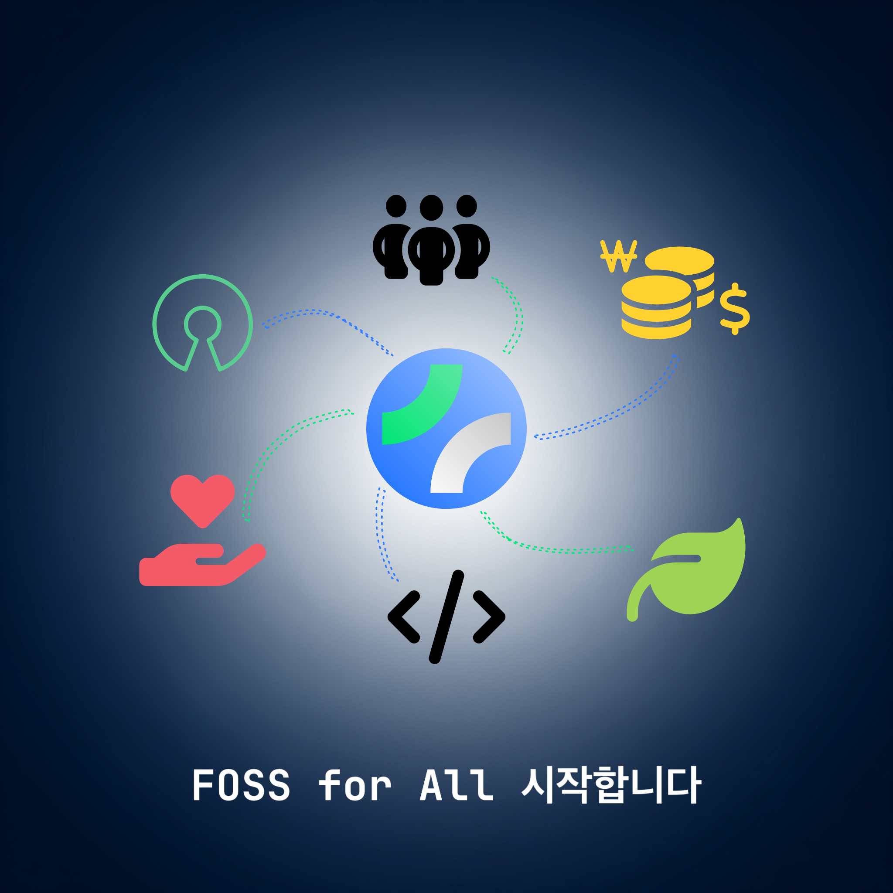

The most realistic barrier that open source projects and communities started with passion face is the difficulty of cost and accounting management. Establishing a separate organization to solve this problem presents another significant burden.

We have taken notice of how Taiwan's [OCF (Open Culture Foundation)](https://ocf.tw) creates a healthy ecosystem by handling community accounting through 'Fiscal Sponsorship'. We deeply empathize that this model is absolutely necessary in Korea as well.

Therefore, FOSS for All begins.

FOSS for All aims to become a professional Fiscal Sponsor for Korea's open source projects and communities. Now, leave the complex accounting and cost management to us, and focus solely on the growth of your projects and communities.

FOSS for All will serve as your reliable accounting team and transparent financial partner.

## 🌱 The First Step Toward a Growing Open Source Ecosystem Together

We are taking our first steps to meet colleagues who will create this wonderful ecosystem together.

Not only large open source projects, but also individual and small-scale precious open source projects will come together to share experiences and grow - the **FOSS for All Conference**, a platform for technical exchange, will visit you this November.

We will share detailed news about the conference soon.

We ask for your interest and support for the first beginning of FOSS for All, which will create meaningful change in Korea's open source ecosystem!

